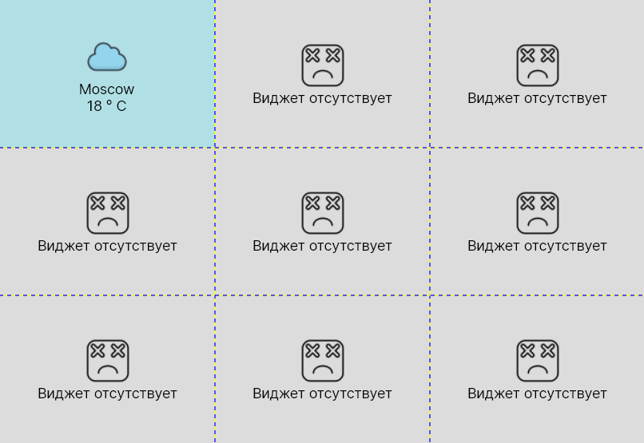
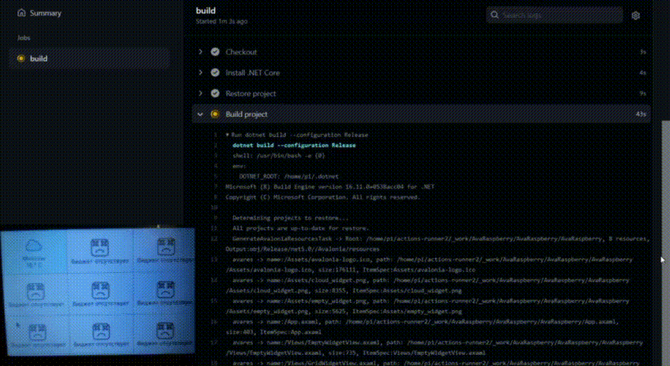

# [AvaRaspberry](https://github.com/boogiedk/AvaRaspberryn)

[](https://github.com/boogiedk/AvaRaspberry/actions/workflows/dotnet-desktop.yml)
[](https://github.com/boogiedk/avaraspberry/pulls) 
[](https://github.com/boogiedk/avaraspberry/issues) 
 

## Project

AvaRaspberry is cross platform desktop application which provide screen with helpful widgets.

Developed predominantly for Raspberry Pi OS (Debian based).

## Overview

### How it looks

AvaRaspberry provide screen with helpful widgets, for example weather, to do list, currencies etc. 

The main screen looks like this:
<p align="center">
 
</p>

## Compiling
Well, if you want just run AvaRaspberry application on your PC with Linux or Window OS, you need to [download and install latest .NET Core SDK](https://www.microsoft.com/net/learn/dotnet/hello-world-tutorial),
clone project and write in console:

1) For Linux shell:
```sh
# Linux shell.

git clone https://github.com/boogiedk/AvaRaspberry
cd ./AvaRaspberry && bash ./build.sh
```

2) For Windows command line:
```sh
# Windows command line.
# Use the '--configuration Release' option to generate app packages.

git clone https://github.com/boogiedk/AvaRaspberry
cd ./AvaRaspberry && powershell -ExecutionPolicy Unrestricted ./build.ps1
```

### Automatic Deployment to your Linux PC
In order to configure automatic deployment for this application, you need to start use [Github Action](https://docs.github.com/en/actions).
Good tutorial for configure [here.](https://www.youtube.com/watch?v=X3F3El_yvFg)
After this, you need to write workflow file (pipeline). For deploing application on raspberry pi OS you can use [this workflow file.](https://github.com/boogiedk/AvaRaspberry/blob/master/.github/workflows/dotnet-desktop.yml)
When you wrote file, you need to trigger your github action job.
Done!

Look at example how it works on Raspberry Pi 4 (Raspberry Pi Os based on Debian):

<p align="center">
  
</p>

## Contributing

Contributors are welcome. Please submit an issue before introducing new features, then you might create a "work in progress" (WIP) pull request to prevent other people from working on the same feature. Dev group is here: [studyAssTalks](https://t.me/studyAssTalks), please feel free to ask questions. If you are new to this project there are some entry-level issues marked with "good first issue" tag.

## Technology stack

* [.NET Core](https://github.com/dotnet)
* [Avalonia](https://avaloniaui.net/)
* [Github Action](https://github.com/features/actions)

